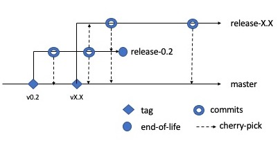

# Aladdin Fabric Developers' Kit

[Aladdin Healthcare Technologies Ltd](https://aladdinid.com/) sponsored the creation of a developers' toolkit (to be known here as the `DevKit`). The toolkit was developed by [Elemental Concept](http://elementalconcept.com/) which was used to build a Hyperledger Fabric (Fabric) based [Proof-of-Concept (PoC) medical audit application](https://www.youtube.com/watch?v=vJmhwymh-eU).

Following from the PoC, Aladdin has kindly open sourced and donated the `DevKit` and make it available to the wider blockchain developers' community to support Fabric applications development effort.

The maintainer(s) of this project is grateful to Aladdin for sponsoring the effort to create the kit and donating the code to this community.

# Design Goals

The design goals of the `DevKit` are to help developers and platform engineers:

* understand the system architecture of Hyperledger Fabric through a series of smoke tests and reference networks;
* to define, instantiate and configure a Fabric network to support development effort;
* learn to orchestrate a Kafka based Fabric network;
* debug chaincodes and client apps.

# Prerequisite

1. Knowledge of [Docker](https://docs.docker.com/).

2. Set up as you would for [Go chaincode development](https://github.com/workingwithblockchain/writing-go-chaincodes#setupDevEnv)

3. Verify that you have a root directory referenced by `$GOPATH` environment variable containing these directories:
```
drwxr-xr-x  3 <userid>  <groupid>  102  3 Feb 15:44 bin
drwxr-xr-x  3 <userid>  <groupid>  102  3 Feb 15:44 pkg
drwxr-xr-x  3 <userid>  <groupid>  102  3 Feb 15:44 src
```

4. Navigate to `$GOPATH` and clone this repository via this command:
```
go get github.com/workingwithblockchain/fabric-devkit
```

5. Navigate to the path `$GOPATH/src/github.com/workingwithblockchain/fabric-devkit` and you will find the toolkits.

# How to use the DevKit

| User story | Guide |
| --- | --- |
| As a developer, I would like to be able to spin up a small Fabric network locally, so I can use it to debug my chaincode and client app. | [dev network guide](./guides/dev-network.md)|
| As a platform engineer, I would like to see a fairly realistic working Kafka based Fabric network, so I can learn to set-up one. | [kafka network guide](./guides/kafka-network.md) |
| As a platform engineer, I would like to be able to conduct experiment with Fabric's cryptogen and configtxgen toolkit and associated configuration files without the need for complex set-up. | [crypto-configtx guide](./guides/crypto-configtx.md) |
| As a platform engineer, I would like to be able to inspect the internals of an operational Fabric Certificate Authority (CA) whilst performing enrollment and registration, so I know how to debug the CA. | [Fabric CA guide](./guides/fabric-ca.md) |
| As a developer, I would like to be able to inspect the internals of an operational Fabric Certificate Authority (CA) whilst performing enrollment and registration, so I can diagnose problems caused by my application whilst interacting with the CA. | [Fabric CA guide](./guides/fabric-ca.md) |
| As a developer, I would like to have a pre-built simple RESTful nodeJS based component that is able to interact with the reference networks, so I learn to create apps using `fabric-client` sdk. | [fabric-node-client guide](./guides/fabric-node-client.md)|

# Content

| Item | Description |
| --- | --- |
| `chaincodes` | A collection of simple Go chaincodes intended primarily to smoke test the preconfigured networks.<br> + `minimalcc` this is the default chaincode package used to smoke test the [dev network](./guides/dev-network) <br> + `one` and `two` are chaincode packages used to smoke test the [kafka network](.guides/kafka-network) |
| `extensions` | These are collections of scripts intended to expand the features of the predefined networks. |
| `guides` | User guides. |
| `networks` | Preconfigured Fabric network orchestrators. |

# Release Notes

| Version | Features | Status |
| --- | --- | --- |
| 0.1 | + Implementation named twoorgs.<br> + Network components based on Fabric 1.1.0 containers and docker compose.<br> + Bash based scripts to support kit orchestration - i.e. macOS and Ubuntu based | + Released.<br> + No further update. |
| 0.2 | + Support for Fabric 1.4.<br> + A laboratory for platform engineers to learn to create cryptographic materials using cryptogen and configtxgen.<br> + A fabric-ca-client cli extension to enable developer smoke test a running fabric-ca-server.<br> + A Fabric network configured to support development work and laboratory exercises.<br> + Two pre-configured networks: a one-org network, and a two-organisations multi-channel network.<br> + A simple `fabric-node-sdk` based RESTful container intended to enable interactions with the pre-configured networks. | + Released.<br> + Please refer to branch release-0.2 |
| 0.3 | + Code to demonstrate process of adding a new organisation to the existing channel in the `dev` network. | + Under development<br> + See master branch. |


# Contributions and Feedback

The maintainer(s) of this project welcomes feedback and contribution from anyone. 

To maintain some order in this project development lifecycle, the principal maintainer shall, currently, retain sole descretion in deciding any features to be incorporated or removed from this repository. 

It is worth emphasising that the long term goal is to have this project supported by multiple maintainers to ensure that there is no single-point-of-failure. A consensus mechanism that can enable this project involve multiple maintainers is currently being established.

# Maintainers

| Role | Name |
| --- | --- |
| Principal maintainer | Paul Sitoh (Elemental Concept) |
| Maintainer |Alok Ashtikar (Elemental Concept) |

## Development life cycle

The DevKit's development lifecycle is based on the trunk (master) and release methodology see Figure 1.

<figure>
    
    <figcaption>Figure 1: Trunk and release</figcaption>
</figure>

The master branch is where all the latest features are being developed.

Release branch are snapshots of master branch with features that have been earmarked for a stated deliverable version. No new features will be added to released branches. Often there will be a period where you will see a maximum two releases branches. This overlap will be temporary. Once the newer release is stablised, the older version will be designated end-of-life and the branch will be earmarked for deletion.

All bug fixes will be done on appropriate release branches and cherry-picked to the master branch and any live preceeding release branch.

Please also refer to the [user journey](https://www.pivotaltracker.com/n/projects/2181160) to follow the DevKit's development lifecycle.

# Disclaimer

The sample codes presented in this `DevKit` are intended only to explain concepts and are **not** intended for use in a mission critical or production environment. Should you choose to reproduce the code for production use, you do so at your own risk.

Unless otherwise specified, the artefacts in this repository are distributed under Apache 2 license.

All artefacts found here are provided on "AS IS" BASIS, WITHOUT WARRANTIES OR CONDITIONS OF ANY KIND, either express or implied.