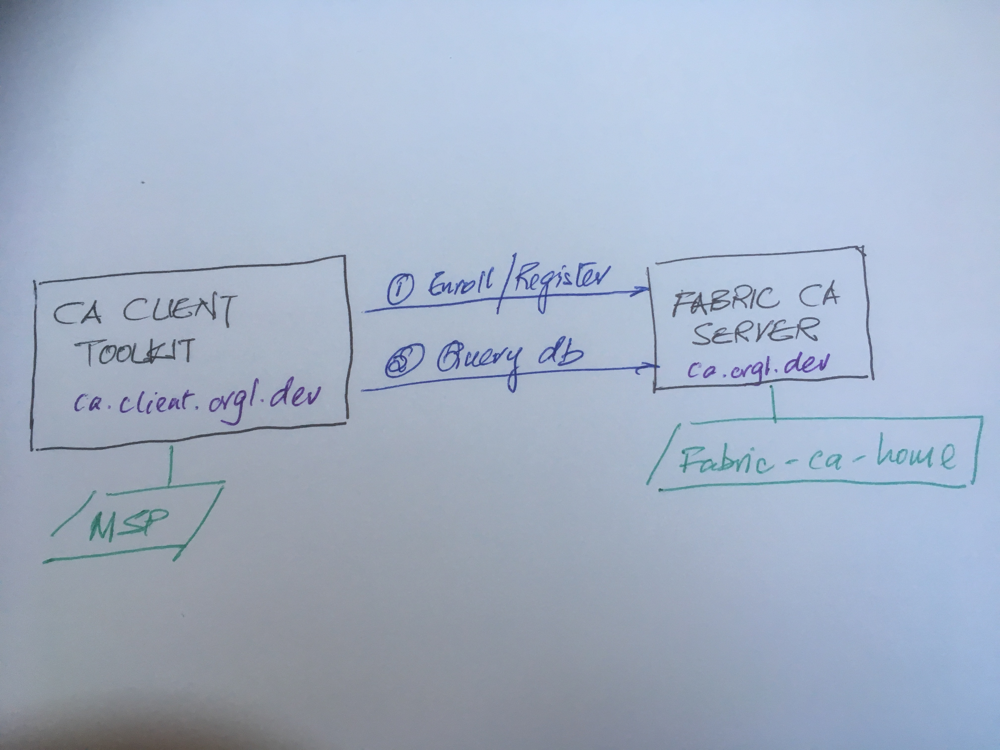

# Fabric Certificate Authority (CA) client 

Please refer to [official documentation (version 1.4)](https://hyperledger-fabric-ca.readthedocs.io/en/release-1.4/) for a detailed explanation of the operations of Fabric CA and its relationship to other aspects of the Fabric artefacts.

This extension contains scripts to enable you to interact with a Fabric CA server that forms part of the [dev network](./networks.md). The scripts provide these functionalities:

* Build a docker image of a Fabric CA client.
* Enroll a registrant who is designated to register a credential (see script [registring-admin2.sh](../extensions/fabric-ca-client/scripts/registering-admin2.sh));
* Revoke a credential (see script [revoke-idenity.sh](../extensions/fabric-ca-client/scripts/revoke-idenity.sh));
* Perform ad hoc query (see note for technical limitation) of Fabric CA database (see script [query.sh](../extensions/fabric-ca-client/scripts/query.sh))).

> NOTE:
> The Fabric CA server in dev network is implemented in sqlite.

<figure>
    
    <figcaption>Figure 1: Fabric CA and ca client interactions</figcaption>
</figure>

# How can I use this extension?

To use it to enroll and register users in the dev network's Fabric CA server please perform the following steps:

1. Navigate to [dev network](../networks/dev).
2. Run the command `./fabricOps.sh network start`, to create an operational Fabric network.
3. Run the command `./fabricOps.sh ca-client start`, to create an instance of Fabric CA client.
4. Run the command `./fabricOps.sh ca-client cli`, this will open up a shell similar this:
   ```
   root@594ed3d57171:/opt/wd#
   ```
5. You can:
   a. registration a credential name `admin2` by running the command `root@594ed3d57171:/opt/wd# ./scripts/registering-admin2.sh`, or
   b. revoke an identity by running the command `root@594ed3d57171:/opt/wd# ./scripts/revoke-identity.sh` or
   c. perform an ad hoc query of the Fabric CA `root@594ed3d57171:/opt/wd# ./scripts/query.sh`.
6. You can observed the end result of the Fabric CA client interaction with Fabric CA server via these folders: [msp](../extensions/fabric-ca-client/msp), which is autogenerated, and [fabric-ca-home](../networks/dev/fabric-ca-home). 

If you wish to perform more operations simply create your own script and deposit [here](../extensions/fabric-ca-client/scripts) and execute the script via Fabric CA client cli. 

# Content

The lab content can be found [here](../extensions/fabric-ca-client).

| Item | Description |
| --- | --- |
| `scripts` | Contains a series of bash scripts embedded in the Fabric client toolkit to: register a new identity; revoke an identity; query the Fabric CA server. |
| `Dockerfile` | A docker specification to help user create Fabric ca client toolkit Docker image. |
| `fabric-ca-client-config.yaml` | A configuration file to help you set the necessary attributed to enable the Fabric CA client to talk to the CA server. |
