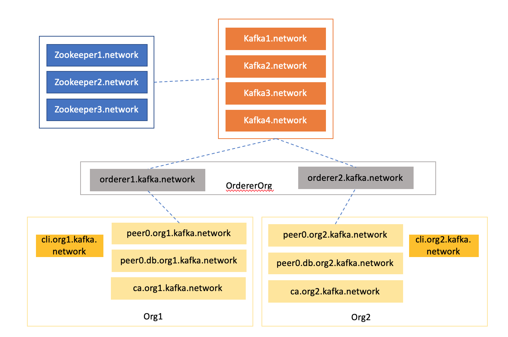

# Kafka Network

Please refer to Fabric's [official documentation on Kafka based Fabric network](https://hyperledger-fabric.readthedocs.io/en/release-1.4/kafka.html)

This core components of a Kafka based Fabric network is illustrated in Figure 1.

<figure>
    
    <figcaption>Figure 1: Kafka Fabric network</figcaption>
</figure>

# How to use the kafka network

This is primarily intended to illustrate a minimum working Kafka based Fabric network. You can also use this as a basis to extend the network to more than two organisations network.

To see it in action:

STEP 1: Navigate to the [orchestrator](../networks/kafka).

STEP 2: Start the kafka cluster please refer to [fabric operations](#fabricOps).

STEP 3: Start the [Fabric network](#fabricOps).

# Content

The kafka network orchestration is located [here](../networks/kafka)

| Item | Description |
| --- | --- |
| `.env` | Shared orchestrator environmental variables |
| `cli-scripts` | This folder contains scripts to configure the dev network by creating channels, installing and instantiating chaincodes |
| `configtx.yaml` | Channel specification please refer to [crypto-configtx guide for details](./crypto-configtx.md)  |
| `crypto-config.yaml` | Crytographic artefact specification [crypto-configtx guide for details](./crypto-configtx.md) |
| `docker-compose.fabric.yaml` | An orchestration file for the Fabric components |
| `docker-compose.kafka.yaml` | An orchestration file for the kafka components |
| `fabricOps.sh` | Please refer to details [here](#fabricOps) |
| `generate-artefacts.sh` | Script to execute configtxgen and cryptogen tool |

## <a name="fabricOps">fabricOps.sh</a>

The principal network orchestration script to help you spin-up, tear down and add supporting components to the network. It is a Bash script based command line application.

### Commands

`./fabricOps.sh kafka <subcommand> | network <subcommand> | status | clean`

#### `kafka` command

Use this command for Kafka oriented operations.

`./fabricOps.sh kafka start | clean`

#### `network` command

Use this command for network oriented operations.

`./fabricOps.sh network start | configure | clean`

#### `status` command

Use this command to display the status of the network.

#### `clean` command

Command to tear down *all* containers in the Fabric network.
